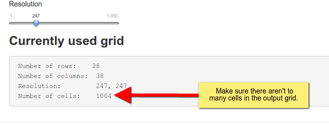

# Output grid
##  When is this important?
For probabilistic home-range estimators (e.g., kernel density estimation), estimates are based on a output grid. The dimension and resolution of this grid can influence the results of the estimation.

## Where is it located
To adjust the output grid go to *Configure > General*  in the navbar and then select *Output Grid* on the left side panel.

## Options 
To define the output grid, it is necessary to define the extent (this is done via a buff) and then the result ion or number of rows and columns.

### Buffer
The baseline for a buffer is a rectangular bounding box around the the relocation. This bounding box can than be buffered in x and y direction individually. Below is an extent with a buffer of 0.

This is not recommended, since most probabilistic home-range estimator will smooth a surface and will extrapolate beyond the bounding box. The next image shows a grid with an intermediate buffer (a recommended choice). 

### Resolution and number of columns and rows
Once the resolution is set, the number of pixels needs to be determined. This can be done in 2 ways:

1. Set a fixed resolution
2. Set the number of rows and columns.

To switch between the two possibilities, select the desired one from the drop down box.

Next choose settings that are appropriate for your study, but make sure the grids does not become to large. The text field below illustrates the number of columns, rows and resolution that is currently used. Usually if the total number of cells exceeds 1000 analysis can become very slow (of course this depends on your hardware). 

