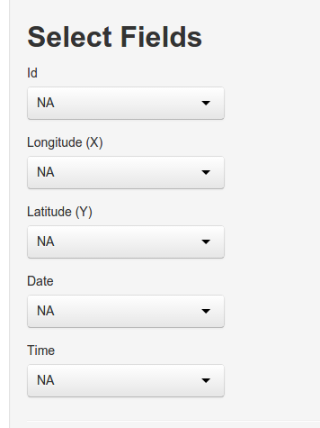

# Mapping Data
After data are successfully loaded into the GUI, **R** needs to know which columns hold which information. We refer to this step as remapping. In order to perform the remapping select in the navbar *Map and Project Data*. 

As a minimum `rhr` requires:

- Longitude (the x coordinates)
- Latitude (the y coordinates)

additionally it is possible to provide an `id` to distinguish different subjects of the data (e.g., animals, seasons, life history stages, etc) and a time stamp. Time stamps can be provided through one or two columns. 

## Spcecifying a time stamp
To specify the time stamp format (i.e. the order of year, month, day, ...) we use the following abbreviations:

- **y**: year
- **m**: month
- **d**: day
- **h**: hour
- **m**: minute
- **s**: second

E.g., all of the following dates (`2015-01-25`, `2015.01.25`, `2015-1-25`, `2015/01/25`, `15.01.25`, `15/1/25`) would be parsed correctly with the date format `ymd`. **R** and in particular the `lubridate` package [@Grolemund2011]. 

### 1 column
This assume that the time of a relocation is saved in the form: `2015-01-01 12:00:23`. If this is the case select the appropriate column in *Date* and the correct format in *Date format*

### 2 columns
This means that date and time of the fix are saved in two different columns. First select the columns that contain date and time and then select the appropriate formats.

# Reprojecting Data

If a valid EPSG code was specified while uploading the data, it is now possible to re-project the data. To do this, enter on the top of the main panel a new valid EPSG (of the desire projection). 

# References

