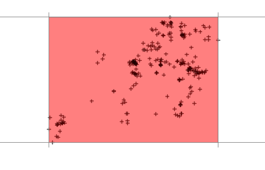
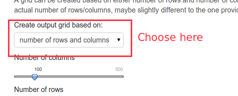

All of these options are located under *Configure > General*  in the navbar and then select the appropriate one on the left side panel.

# Ouput
##  When is this important?
This determines a `pdf` report is generated in addition to an `html` report and where it is saved.

## Options
### Generate a pdf file
This will generate a `pdf` report in addition to the html report. This option will require a valid `LaTeX` installation on you system. 

### Copy results to current workding directory
This option allows to copy the result of the analysis to the current working directory (if you do not have writing permissions in your working directory this will fail). 

When you start R you can set your working directory with:

```{r, eval = FALSE}
setwd("my_analysis")
```

or use `getwd()` to find out what your current working directory is. 
If you tick this option, a new directory will be created in the current working directory an all results are saved there. If you do not tick it, results will be saved in a temporary file.

# Units
##  When is this important?
If the desired output units are different from the input units. E.g., if the input units are in meters (as it is the case for many projected coordinate systems) and the desired areal output units not $m^2$ but hectares.

## Options 
Two select inputs are available. The first one specifies the input units. If they are unknown, simply select *I dont know*. The second select box allows for selecting output units. 


# Output grid
##  When is this important?
For probabilistic home-range estimators (e.g., kernel density estimation), estimates are based on a output grid. The dimension and resolution of this grid can influence the results of the estimation.


## Options 
To define the output grid, it is necessary to define the extent (this is done via a buff) and then the result ion or number of rows and columns.

### Buffer
The baseline for a buffer is a rectangular bounding box around the the relocation. This bounding box can than be buffered in x and y direction individually. Below is an extent with a buffer of 0.



This is not recommended, since most probabilistic home-range estimator will smooth a surface and will extrapolate beyond the bounding box. The next image shows a grid with an intermediate buffer (a recommended choice). 


### Resolution and number of columns and rows
Once the resolution is set, the number of pixels needs to be determined. This can be done in 2 ways:

1. Set a fixed resolution
2. Set the number of rows and columns.

To switch between the two possibilities, select the desired one from the drop down box.



Next choose settings that are appropriate for your study, but make sure the grids does not become to large. The text field below illustrates the number of columns, rows and resolution that is currently used. Usually if the total number of cells exceeds 1000 analysis can become very slow (of course this depends on your hardware). 


# Levels
##  When is this important?
If isopleth levels, different from the default ones, are of interest.

## Options 
Provide desired isopleth levels as single numbers. If more than isopleths levels is required a comma separated list possible. E.g., `50,75,90`.


