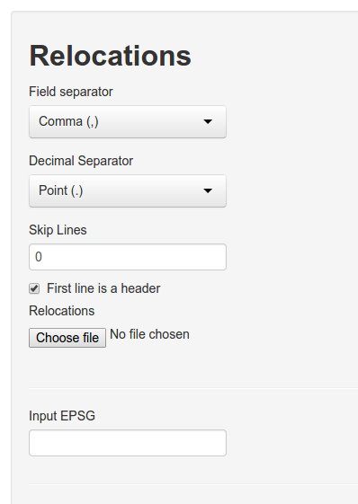

# Reading data from a text file
[Delimiter-seperated values](http://en.wikipedia.org/wiki/Delimiter-separated_values) is a very common format to save data (e.g., `csv`-files). Select from the navbar: *Load Data*. In the side panel several options for loading data become available. 



To upload a file:

1. Select the appropriate field separator.
2. Adjust the decimal separator if needed (this is important if your coordinates contain decimal numbers).
3. Decide if any lines should be skipped in the beginning of the files (this is interesting if you want to analyze data comes directly from a tracking device with meta information).
4. Indicate if the first line contains a header or not. If no header is present **R** will come up with one.
5. Finally choose the file from your hard drive.
6. If you want to re-project your data before the analysis, you need to provide a valid EPSG code here. (For example if you collected data in geographical coordinates, 4326 would be the appropriate EPSG code).

If everything went wrong, the first 25 entries of the file.


If there was an error (e.g. the wrong field separator was chosen), the upload may still succeed but fields are not separated properly. In the image below we selected `;` as a field separator, but `,` would have been the correct one. 


# Reading data from R
Data can be read directly from **R** when starting the GUI.

```{r, eval = FALSE}
# load the library
library(rhr)
data(datSH)

# start the GUI
rhrGUI(datSH)
```


