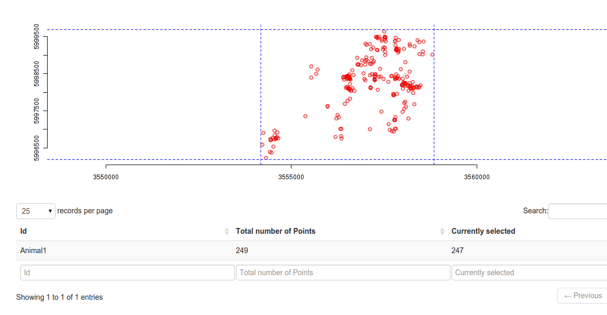
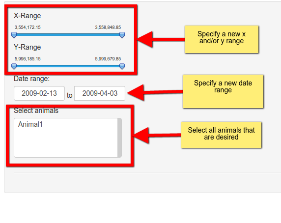

# When is this important?
If only parts of the data set should be used for the analysis. The `rhr` GUI allows subsets based on:

1. Time
2. Space
3. Individual id

# Where is it located?
To perform a subset go to *Subset Data*  in the navbar. 

# Options 
In the main panel the currently used bounding box (blue dashed lines) are shown together with all points (red = used). 

In the side panel a number of options are available to perform subsets based on space, time and id. 

