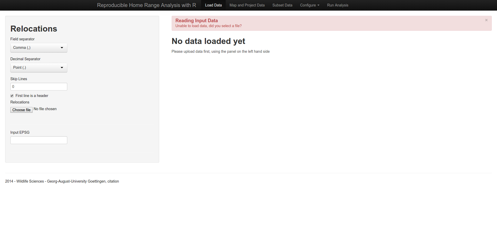
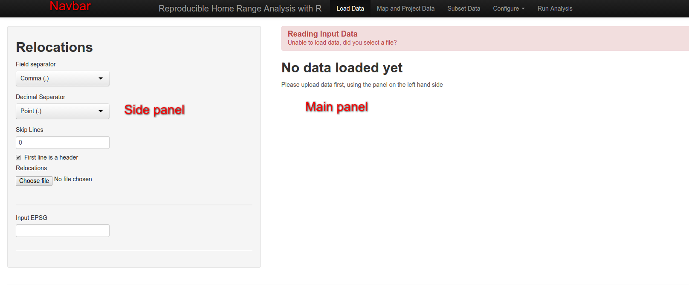

# Open the GUI

Open any R command line, e.g. an R console or RStudio and type the following command:

```{r, eval = FALSE}
# load the library
library(rhr)

# start the GUI
rhrGUI()
```

This should open a web browser that has a an open tab like this:



# GUI --- some terminology
For easier description of further sections of this guide, we refer to the following terms frequently:

- **navbar**: the navigation bar
- **side panel**: left side hand side of the GUI, often with grey background.
- **main panel**: main area of the GUI


